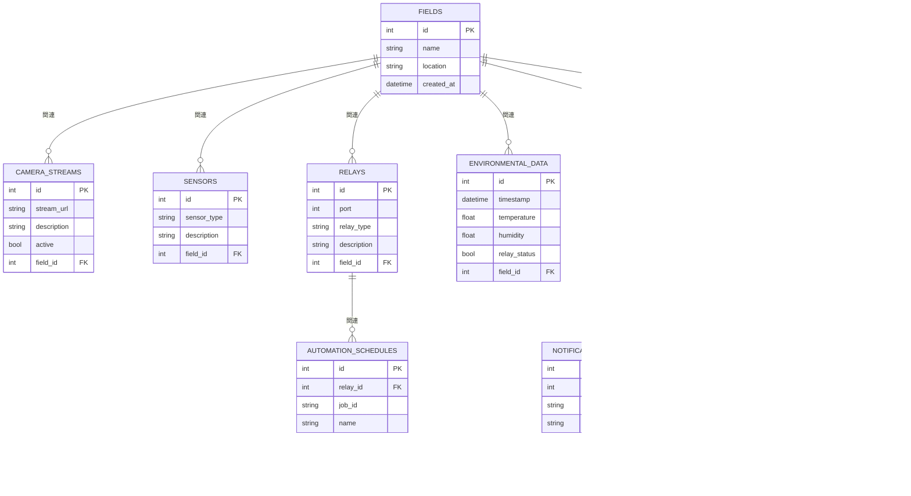

# データベース設計

engine : SQLite3

## ER図



## テーブル構造

```
FIELDS {
    int id PK                  -- 圃場ID（プライマリキー）
    string name                -- 圃場の名前
    string location            -- 圃場の設置場所
    datetime created_at        -- 圃場の登録日時
}
```
```
CAMERA_STREAMS {
    int id PK                  -- プライマリキー
    string stream_url          -- ライブストリームのURL
    string description         -- カメラの説明や位置情報など
    bool active                -- ストリームがアクティブかどうか
    int field_id FK            -- 圃場ID（FIELDSテーブルへの外部キー）
}
```
```
SENSORS {
    int id PK                  -- センサーID（プライマリキー）
    string sensor_type         -- センサーの種類（"temperature", "humidity"など）
    string description         -- センサーの説明や設置位置
    int field_id FK            -- 圃場ID（FIELDSテーブルへの外部キー）
}
```
```
RELAYS {
    int id PK                  -- リレーID（プライマリキー）
    int port                   -- リレーのGPIO番号
    string relay_type          -- リレーの種類
    string description         -- リレーの説明や設置位置
    int field_id FK            -- 圃場ID（FIELDSテーブルへの外部キー）
}
```
```
ENVIRONMENTAL_DATA {
    int id PK                  -- プライマリキー
    datetime timestamp         -- データが記録された日時
    float temperature          -- 温度データ（NULL可能）
    float humidity             -- 湿度データ（NULL可能）
    bool relay_status          -- 照明のON/OFF状態（NULL可能）
    int field_id FK            -- 圃場ID（FIELDSテーブルへの外部キー）
}
```
```
AUTOMATION_SCHEDULES {
    int id PK                  -- プライマリキー
    int relay_id FK            -- リレーID（RELAYSテーブルへの外部キー）
    string job_id              -- ジョブID
    string name                -- スケジュール名
    string cron                -- Cron形式のスケジュール設定
    bool active                -- スケジュールの有効/無効
    datetime next_run_time     -- 次回実行予定時間
}
```
```
NOTIFICATION_SCHEDULES {
    int id PK                  -- プライマリキー
    int plant_id FK            -- 対象の苗ID（PLANTSテーブルへの外部キー）
    string task_type           -- タスクの種類（"watering", "fertilizing", "seeding"など）
    string description         -- タスクの説明
    string cron                -- Cron形式のスケジュール設定
    bool active                -- スケジュールの有効/無効
    datetime next_run_time     -- 次回通知予定時間
}
```
```
PLANTS {
    int id PK                  -- プライマリキー
    string name                -- 苗の名前
    string species             -- 種類
    date planting_date         -- 開始日（植え付け、播種、購入などによって）
    date end_date              -- 終了日（収穫や枯死などの終了理由に関係なく）
    string status              -- 現在のステータス（"new", "growing", "harvested" など）
    datetime last_updated      -- 最終更新日時
    int field_id FK            -- 圃場ID（FIELDSテーブルへの外部キー）
}
```
```
SNAPSHOTS {
    int id PK                  -- プライマリキー
    datetime timestamp         -- スナップショットが撮影された日時
    string file_path           -- スナップショット画像ファイルのパス
    int field_id FK            -- 圃場ID（FIELDSテーブルへの外部キー）
}
```
```
OBSERVATIONS {
    int id PK                  -- プライマリキー
    int plant_id FK            -- 対象の植物ID（PLANTSテーブルへの外部キー）
    datetime observation_date  -- 観察が行われた日付と時刻
    string comment             -- 観察に関するコメントやメモ
    string observer_name       -- 観察を行った人の名前（オプション）
}
```